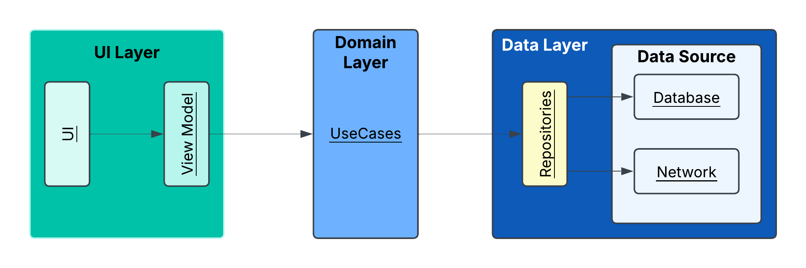

## Description

**Cat** is an Android application that shows cats' breeds.
it uses the [TheCatApi](https://thecatapi.com/) to fetch data. also, it has been developed in a **modular** way.

**NOTE:**
Due to the temporary nature of the project, some experimental features have been used.(such
as `ExperimentalMaterial3Api`). I am aware of the risks of using experimental features in production
projects.

## Architecture

It follows **Clean Architecture**. The application architecture follows below image:

**NOTE:**
Please note that the dependencies are not exactly as shown by the arrows in the diagram.
As you know, according to **Clean Architecture**, the **data layer is dependent on the domain** (
although many people think the opposite)

### Modules:
- **:catbreed:domain**
- **:catbreed:presentation**
- **:catbreed:repository**
- **:datasource:remote:theCatApi**
- **:datasource:local:roomDatabase**
- **:app**
- **:core:util**

### UseCases:
- **CatBreedListUseCase:** It is used for getting cats' breed list (It uses  CombineCatFavoriteRepository)
- **CatBreedDetailUseCase:** It is used for getting a cat breed detail 
- **ToggleFavoriteCatUseCase:** It is used for changing favorite cat

### Repositories:
- **CatBreedListRepository:** It is used for receiving cat list from CatApiService
- **FavoriteCatRepository:** It is used for communicating with database
- **CombineCatFavoriteRepository:** It combine two above repositories (It created because of single responsibility)
- **CatBreedDetailRepository:** It is used for receiving cat detail from CatApiService

## Tech Stack

- **Clean Architecture:** it is a recommended way to build Android applications by Google
- **Spotless:** code formatter that helps me to keep my code clean and consistent
- **Gson:** it is a Java library that used to convert Java Objects into their JSON representation
- **Retrofit:** it is a type-safe REST client for Android and Java
- **Room:** it is a part of the Android Jetpack libraries that provides an abstraction layer over
  SQLite to allow for more robust database access while harnessing the full power of SQLite
- **Hilt:** it is a dependency injection library for Android that reduces the boilerplate of doing
  manual dependency injection in your project
- **Flow:** it is a new reactive stream library that is part of the Jetpack libraries
- **Coroutine:** it is a concurrency design pattern that you can use on Android to simplify code
  that executes asynchronously
- **ViewModel:** manage UI-related data in a lifecycle-conscious way
- **Jetpack Compose:** modern toolkit for building native Android UI
- **Coil:** image loading library
- **Test:**
    - **JUnit:** it is a simple framework to write repeatable tests
    - **mockwebserver:** it is a scriptable web server for testing HTTP clients
    - **Mockito:** mocking framework used to mock classes and interfaces
  
## TO Do

- **Searching among cat breeds**
- **ViewModel Test:** Unfortunately, Unfortunately, it fails due to Dispatcher.IO in the ViewModel, where the comparison happens before the changes in the ViewModel are applied
- **Other Test Cases**

