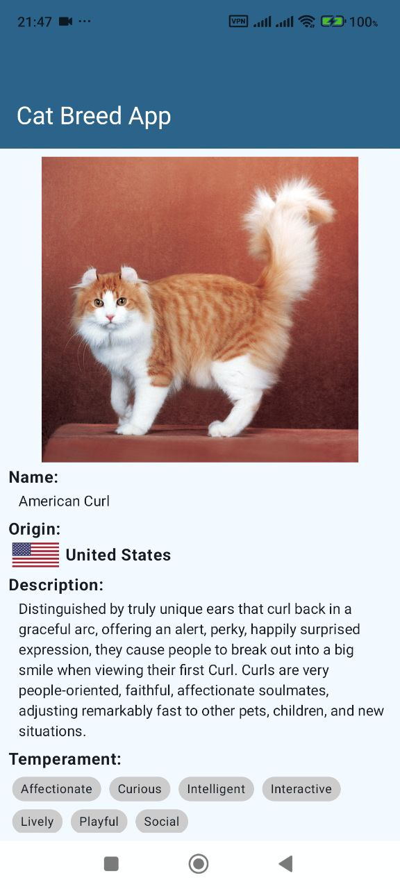

## Description

**Cat** is an Android application that shows cats' breeds.
it uses the [TheCatApi](https://thecatapi.com/) to fetch data.

---
**NOTE**
Due to the temporary nature of the project, some experimental features have been used.(such
as `ExperimentalMaterial3Api`). I am aware of the risks of using experimental features in production projects.
--- 

## Architecture

It follows **Clean Architecture**. Application architecture follows below image:

---
**NOTE**
Please note that the dependencies are not exactly as shown by the arrows in the diagram.
As you know, according to **Clean Architecture**, the **data module is dependent on the domain** (although many people think the opposite)
---

## Tech Stack

- **Clean Architecture:** it is a recommended way to build Android applications by Google
- **Spotless:** code formatter that helps me to keep my code clean and consistent
- **Gson:** it is a Java library that used to convert Java Objects into their JSON representation
- **Retrofit:** it is a type-safe REST client for Android and Java
- **Room:** it is a part of the Android Jetpack libraries that provides an abstraction layer over SQLite to allow for more robust database access while harnessing the full power of SQLite
- **Hilt:** it is a dependency injection library for Android that reduces the boilerplate of doing manual dependency injection in your project
- **Flow:** it is a new reactive stream library that is part of the Jetpack libraries
- **Coroutine:** it is a concurrency design pattern that you can use on Android to simplify code that executes asynchronously
- **ViewModel:** manage UI-related data in a lifecycle-conscious way
- **Jetpack Compose:** modern toolkit for building native Android UI
- **Coil:** image loading library
- **Test:**
    - **JUnit:** it is a simple framework to write repeatable tests
    - **mockwebserver:** it is a scriptable web server for testing HTTP clients
    - **Mockito:** mocking framework used to mock classes and interfaces
  

